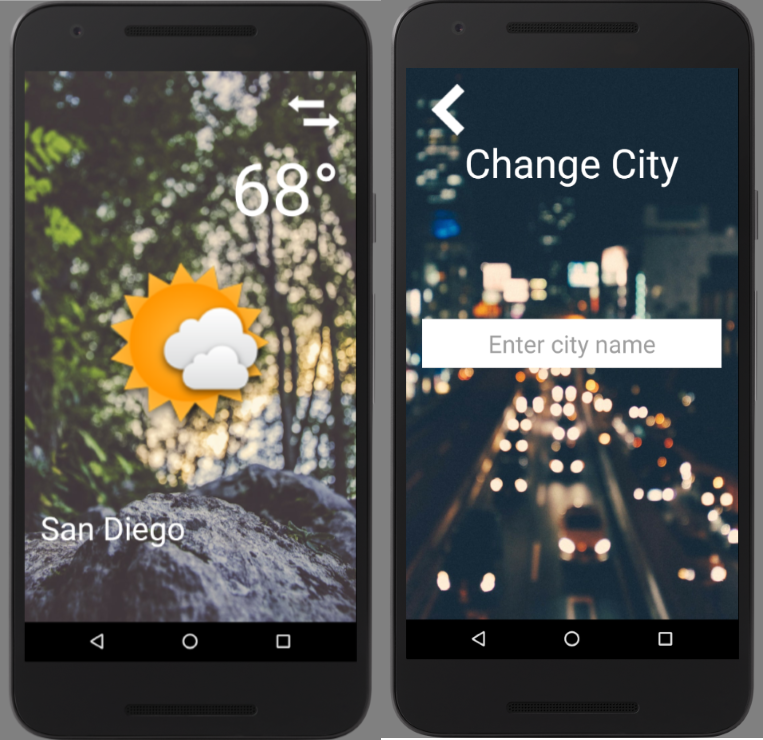

# Weather-AndroidApp
An app that displays the weather (temperature and condition) of either the user's current location or a city that the user entered.

This app uses the android phone location service or user-entered city location 
and makes API call to OpenWeatherMap (https://openweathermap.org/api) to retrieve weather data.

